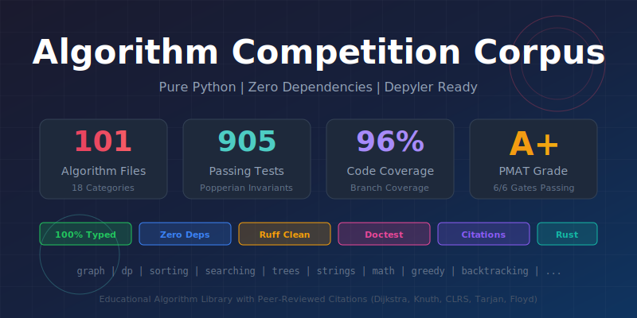

# Algorithm Competition Corpus



A pure Python algorithm corpus with **EXTREME quality standards** for Depyler transpilation and education.

## PMAT Scorecard

| Metric | Value | Status |
|--------|-------|--------|
| **Algorithm Files** | 101 | ✅ |
| **Test Cases** | 905 | ✅ |
| **Code Coverage** | 96.27% | ✅ |
| **PMAT TDG Grade** | A+ | ✅ |
| **Quality Gates** | 6/6 Passing | ✅ |

## Quality Standards

| Metric | Requirement |
|--------|-------------|
| **Dependencies** | Zero (stdlib only) |
| **Type Coverage** | 100% |
| **Test Coverage** | 96%+ branch (95% min) |
| **PMAT TDG Grade** | A+ |
| **Lint Violations** | Zero |

## 6 Quality Gates (PMAT Comply)

All gates must pass before any commit:

| Gate | Tool | Check |
|------|------|-------|
| 1 | `ruff format --check` | Code formatting |
| 2 | `ruff check` | Lint violations |
| 3 | `ty check` | Type errors |
| 4 | `pytest --doctest-modules` | Doctest examples |
| 5 | `pytest` | Unit tests |
| 6 | `pytest --cov` | 95% branch coverage |

```bash
make comply   # Run all 6 gates
```

## Toolchain

```bash
uv      # Package management
ruff    # Linting + formatting
ty      # Type checking
pytest  # Testing
pmat    # Project management
```

## Quick Start

```bash
# Setup
uv sync
make dev-setup

# Run all quality gates
make comply

# Development
make format   # Auto-format
make fix      # Auto-fix lint issues
make test     # Run tests
make coverage # With coverage report
```

## Categories (18 Categories, 101 Files)

| Category | Files | Description |
|----------|-------|-------------|
| `graph/` | 9 | BFS, DFS, Dijkstra, Bellman-Ford, union-find, topological sort |
| `dynamic_programming/` | 7 | Fibonacci, knapsack, LCS, LIS, edit distance, word break |
| `sliding_window/` | 2 | Kadane's algorithm, window patterns |
| `two_pointers/` | 5 | Two sum, container, palindrome, partition, subarray |
| `binary_search/` | 5 | Binary search, rotated array, peak element, bounds |
| `backtracking/` | 4 | N-queens, permutations, subsets, sudoku |
| `bit_manipulation/` | 3 | Basic ops, advanced ops, bit tricks |
| `sorting/` | 5 | Quicksort, mergesort, heapsort, counting, radix |
| `heap/` | 3 | Heap operations, kth element, kth problems |
| `tree/` | 5 | Traversals, BST validation, LCA, tree properties |
| `linked_list/` | 4 | List node, list ops, list problems, advanced |
| `string/` | 4 | KMP, Rabin-Karp, string ops, longest substring |
| `math/` | 5 | GCD, primes, power, combinatorics, geometry |
| `interval/` | 2 | Interval operations, interval scheduling |
| `stack/` | 3 | Expression evaluation, parentheses, monotonic stack |
| `queue/` | 2 | Sliding max, queue reconstruction |
| `matrix/` | 3 | Matrix operations, search, path finding |
| `divide_and_conquer/` | 3 | Binary search DC, merge sort DC, max subarray |
| `number/` | 2 | Conversion, digit operations |
| `greedy/` | 4 | Activity selection, interval scheduling, jump game |

## Type Annotation Requirements

All files use **modern Python 3.12+ syntax** (PEP 585 + PEP 604):

```python
from __future__ import annotations

import heapq


def dijkstra(
    graph: dict[int, list[tuple[int, int]]],
    start: int,
) -> dict[int, int]:
    """Find shortest paths from start to all nodes.

    References:
        [1] Dijkstra, E.W. (1959). Numerische Mathematik. 1: 269-271.

    Examples:
        >>> dijkstra({0: [(1, 4)], 1: []}, 0)
        {0: 0, 1: 4}
    """
    distances: dict[int, int] = {start: 0}
    heap: list[tuple[int, int]] = [(0, start)]
    # ... implementation
    return distances
```

## Popperian Falsification

Tests are designed to **disprove** correctness via invariant properties:

```python
def test_p1_distances_non_negative(self) -> None:
    """P1: If any d[v] < 0, Dijkstra is WRONG."""
    for _ in range(100):
        graph = random_graph()
        distances = dijkstra(graph, 0)
        for d in distances.values():
            assert d >= 0, "Invariant P1 violated"
```

## Depyler Transpilation

```bash
# Transpile a single file
depyler transpile src/algorithm_corpus/graph/dijkstra.py

# Analyze the entire corpus
depyler-corpus analyze --corpus ~/src/algorithm-competition-corpus
```

## Project Structure

```
algorithm-competition-corpus/
├── pyproject.toml          # Project config (uv)
├── ruff.toml               # EXTREME lint config
├── ty.toml                 # Type checker config
├── Makefile                # Quality gates
├── CLAUDE.md               # Development guidelines (P0)
├── src/
│   └── algorithm_corpus/
│       ├── __init__.py
│       ├── py.typed
│       ├── graph/
│       ├── dynamic_programming/
│       └── ...
└── tests/
    ├── conftest.py         # Fixtures
    ├── test_graph/
    └── ...
```

## Development Workflow

```bash
# 1. Start work
pmat work start ALGO-XXX

# 2. Create algorithm + tests

# 3. Run quality gates (ALL must pass)
make comply

# 4. Commit
git commit -m "feat: add algorithm"

# 5. Complete work
pmat work complete ALGO-XXX
```

## Design Principles

- **Stdlib only**: Zero external dependencies
- **Fully typed**: Modern syntax with `dict[K, V]`, `list[T]`, `T | None`
- **Peer-reviewed**: Every algorithm cites academic sources
- **Falsifiable**: Tests designed to disprove, not just verify
- **Iterative**: Prefer iteration over recursion for Rust translation
- **Self-contained**: Each file stands alone

## Corpus Tiers

This corpus is **Tier 4** in the Depyler ecosystem:

| Tier | Repository | Focus |
|------|------------|-------|
| 1 | reprorusted-std-only | Stdlib module mapping |
| 2 | reprorusted-python-cli | CLI tooling patterns |
| 3 | hugging-face-ground-truth-corpus | ML/AI patterns |
| **4** | **algorithm-competition-corpus** | **Algorithmic patterns** |
| 5 | jax-ground-truth-corpus | Numerical computing |

## License

MIT
